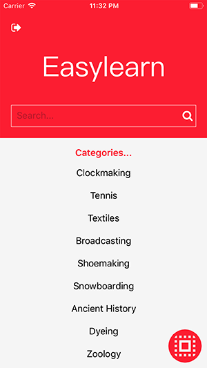
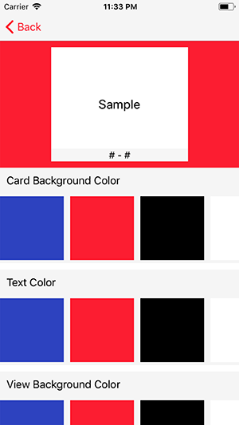
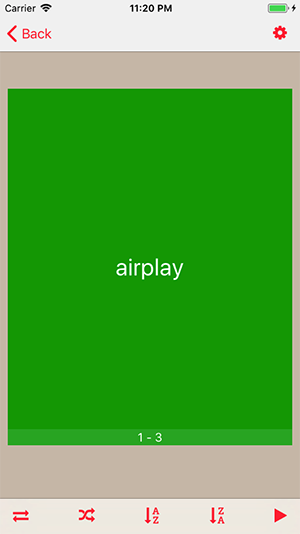

## EasyLearn: Beyond Flashcards

This is an iOS application built with Swift 3. This app uses the Oxford Dictionaries API. It's ready to be put on the App Store. All you need is to register your app in the [Oxford Dictionaries API](https://developer.oxforddictionaries.com/) so that you can use the API as your data source.

Since I don't want to pay monthly for the API, I decided to open source the project.

The app uses Firebase as its backend database to store user information such as the number of word searches per user.

The app uses Facebook SDK as an alternative for login. Once the user logged in, the information such as email is stored in the Firebase Database.

The current features:

0. On boarding pages to describe the app before login
2. Search for words or user word category to find a word.
3. Favorite a word. The app uses Core Data as local database.
4. Use Flashcards to study the saved words.
5. Play the flashcards to quickly go through the saved word.
6. Create your own flashcards with whatever colors you want for text, flashcard background color, and view color.

## Setup
To setup the project:
1. create a developer account at [Oxford Dictionaries ](https://developer.oxforddictionaries.com/)
2. Get the app id and app key from the Oxfored Dictionaries developer dashboard. Set the **appID** and **appKey** in the **Resources.swift** file in the Networking folder.
3. Create a Firebase account and put GoogleService-Info in the project.

## Firebase Database Structure
Each user has four fields:
1. isUpdated: this field checks if the monthly quota is updated per user.
2. month: sets the current month
3. year: sets the current year
4. searchLimit: keeps track of word searches.

Currently the flow of the application is that when a user is registered for the first time, they're allowed 30 words. When they search for a word, the searchLimit variable keeps track of the searches and decrements. At the end the month, when a user tries to search for a new word, the code behind checks which year and which month it is, and whether the user has updated quota for the month, if not, it is updated.

These are some of the screenshots of the app.

